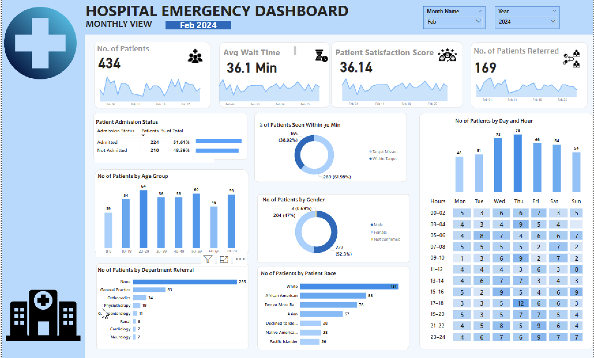

# 🧾Hospital Emergency Dashboard using Power BI, Power Query, DAX

> A project to modernize emergency department reporting and patient flow analytics using Power BI.

---

## 🚀 Project Overview

This project demonstrates how data visualization and analytics can optimize emergency room operations and improve patient care.
Using Power BI, the dashboard consolidates patient data, enabling stakeholders to monitor admissions, wait times, referrals, and satisfaction, all in real time.
---
## 📌 Business Problem

Hospitals often struggle to maintain efficient ER operations due to:

- High patient volume
- Long wait times
- Limited visibility into hourly and daily patterns
- Manual reporting
- Inconsistent data on patient satisfaction

This dashboard addresses these challenges with a centralized, interactive reporting solution that helps improve service delivery, resource planning, and patient experience.
---
## 📊 Key KPIs (Important Numbers We Track)

These KPIs help monitor operational performance and identify improvement areas.

| KPI Name                | What It Tells Us |
|-------------------------|------------------|
| **Number of Patients**      | Total volume of ER patients in the selected period. |
| **Average Wait Timee** | Average time patients waited before being seen. |
| **Patient Satisfaction Score**  | How satisfied patients were with their ER experience. |
| **Number of Patients Referred**       | How many patients were referred to other departments or specialists. |
| **% of Patients Seen Within 30 Minutes**   | How quickly patients were triaged and treated compared to the target benchmark. |
| **Admission Status** | The split between admitted vs. non-admitted cases. |

🧠 **Why These Matter Together**:
- They help pinpoint operational bottlenecks (long wait times, poor satisfaction).
- Identify peak hours and days to improve staffing.
- Show progress towards compliance targets (e.g., seeing patients within 30 minutes).
- Support decisions about resource allocation and workflow changes.

---

## 🖼️ Dashboard Snapshots

### 📄 1. Monthly View

A focused view for analyzing any specific month.

✅ Highlights:

- Daily trends in patient counts, wait times, and satisfaction.
- Admission and referral metrics.
- Demographics filtered for the selected month.
- Hourly heatmap for operational insights.

---

### 📄 2. Consolidated View

An overall, high-level summary of emergency department performance across all available data.

✅ Highlights:

- Monthly trends in patient volume, wait time, and satisfaction.
- Total counts of admitted and referred patients.
- Age group, gender, and race demographics.
- A heatmap of arrivals by day and hour.

---

## 📘 Key DAX Insight: Filed Report Percentage

As part of building this dashboard, I created a DAX measure to track how effectively the ER meets its triage benchmark.
---

### 📌 DAX Formula

### 🖼️ Screenshot: Filed Report Percentage KPI

### 🧮 What the Formula Does

This DAX formula calculates the **percentage of clients who have filed their tax reports**.

- `COUNTROWS(ClientData)` counts all the clients in the dataset.
- `CALCULATE(..., ClientData[Report Status] = "Filed")` filters only those records where the report status is marked as "Filed".
- `DIVIDE` divides the number of filed reports by the total number of clients, and handles any divide-by-zero errors safely.

📊 **For example**:  
If 3,500 out of 5,000 clients submitted their reports:

